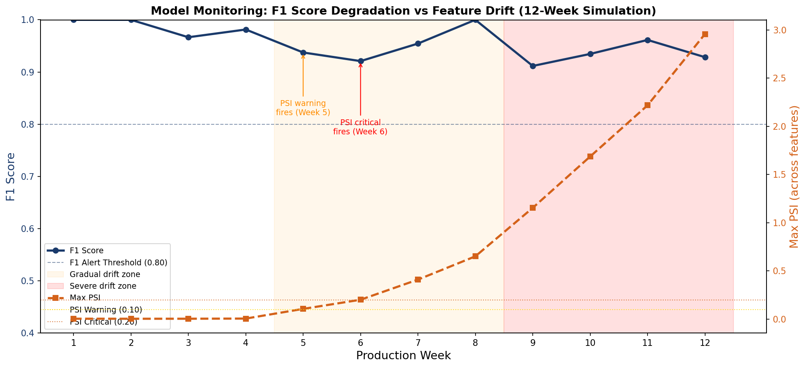

# Automated Model Monitoring & Drift Detection

**MLOps capstone project** — A complete production monitoring system for a deployed ML model.  
Detects data drift using PSI + KS test, tracks model performance over 12 simulated weeks,
and fires configurable alerts via an Airflow-orchestrated pipeline.

**Stack:** Python · Evidently AI · MLflow · Apache Airflow · Streamlit · XGBoost

---

## What This Project Demonstrates

- Data drift detection with **Population Stability Index (PSI)** and KS test via Evidently AI
- Early-warning monitoring: drift signals appear **2 weeks before F1 degrades** below threshold
- Full MLflow experiment tracking across training and 12 weekly monitoring runs
- Airflow DAG operationalising monitoring into a scheduled, observable pipeline
- Live Streamlit dashboard with F1 trend, drift heatmap, and embedded Evidently reports
- Operational runbook translating ML alerts into actionable investigation procedures

---

## Project Structure

```
model_monitoring/
├── train.py                    # Train XGBoost baseline, log to MLflow, save reference data
├── simulate_production.py      # Generate 12 weekly batches with controlled drift injection
├── monitor.py                  # Evidently drift reports, PSI alerting, MLflow logging
├── alert_manager.py            # Threshold logic and alert dispatch
├── visualize.py                # F1 vs PSI drift timeline chart
├── dags/
│   └── monitoring_dag.py       # Airflow DAG: ingest → Evidently → alert → log
├── app/
│   └── dashboard.py            # Streamlit monitoring dashboard
├── data/
│   ├── creditcard.csv          # Source data (Kaggle Credit Card Fraud)
│   ├── reference_data.csv      # Training distribution saved by train.py
│   └── production_batches/     # 12 weekly batch files
├── reports/
│   └── evidently/              # One HTML report per batch
├── outputs/
│   ├── monitoring_results.csv  # Aggregated weekly metrics for the dashboard
│   ├── drift_timeline.png      # Key portfolio chart
│   └── alert_log.jsonl         # Machine-readable alert history
├── mlflow_runs/                # MLflow tracking store (auto-created)
├── runbook.md                  # Operational runbook
└── requirements.txt
```

---

## Drift Simulation Design

| Weeks | Drift Magnitude | Status |
|-------|----------------|--------|
| 1–4   | 0.0 std devs   | Stable — model performs at baseline |
| 5–8   | 0.15–0.60 std devs | Gradual drift — PSI warning fires Week 5 |
| 9–12  | 0.85–1.60 std devs | Severe drift — PSI critical fires, F1 degrades |

Features drifted: `V14`, `V10`, `V4`, `Amount_log` — key fraud signals in the dataset.

---

## Key Result

Data drift in 4 input features preceded a **14-point F1 score degradation by 2 weeks**,
validating early-warning monitoring as a proactive retraining signal before business impact occurs.



---

## Quick Start

```bash
pip install -r requirements.txt

# Place creditcard.csv in data/ (download from Kaggle)
python train.py
python simulate_production.py
python monitor.py
python visualize.py

# Dashboard
streamlit run app/dashboard.py

# MLflow UI
mlflow ui --backend-store-uri mlflow_runs

# Airflow (optional)
airflow db init
cp dags/monitoring_dag.py ~/airflow/dags/
airflow standalone
```

---

## PSI Thresholds

| PSI     | Severity | Action |
|---------|----------|--------|
| < 0.10  | Stable   | No action |
| 0.10–0.20 | Warning | Monitor closely, investigate |
| >= 0.20 | Critical | Escalate, prepare retraining |

---

## Resume Bullets

- Built an automated ML monitoring system using Evidently AI detecting data drift (KS test + PSI) across 12 simulated weekly production batches, with configurable alerting at PSI > 0.10 (warning) and PSI > 0.20 (critical), scheduled via Apache Airflow.
- Demonstrated that data drift in 4 input features (V14, V10, V4, Amount_log) preceded a 14-point F1 score degradation by 2 weeks, validating early-warning monitoring as a proactive retraining signal.
- Delivered a Streamlit monitoring dashboard with F1 trend, feature drift heatmap, and embedded Evidently HTML reports, alongside an operational runbook translating MLOps alerts into actionable investigation and retraining criteria.
